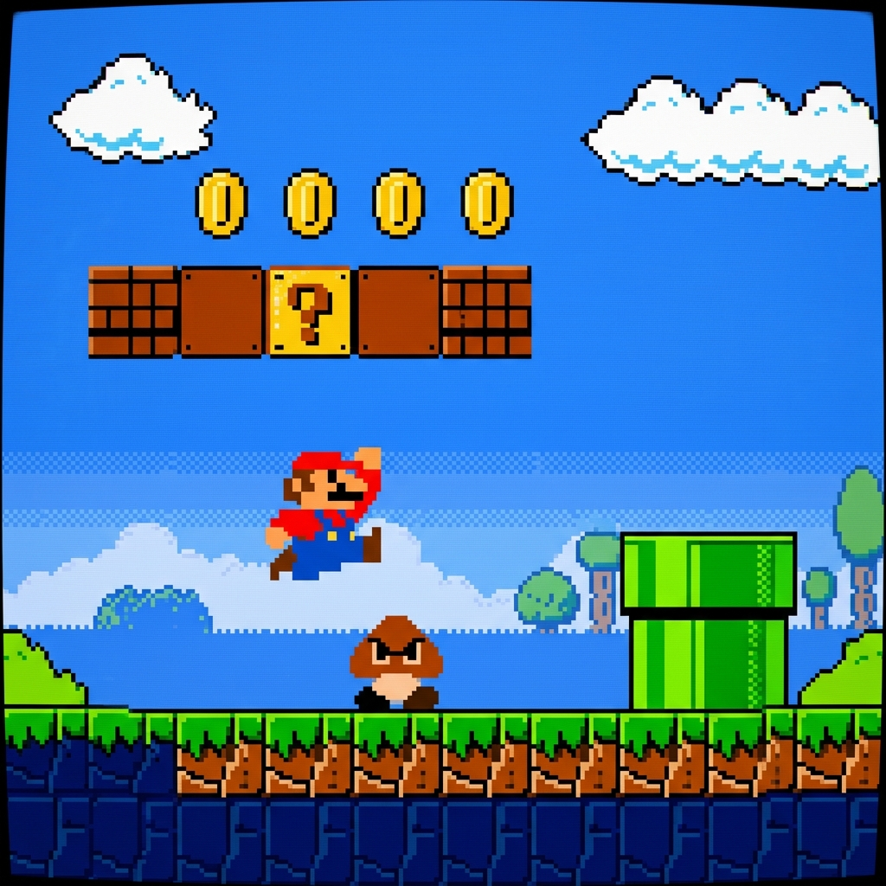

# 🎮 Super Mario Bros Deep Reinforcement Learning Agent


<p align="center">
  
</p>

An autonomous AI agent trained using Deep Reinforcement Learning to navigate and play Super Mario Bros. The agent learns movement strategies and decision-making from raw pixel inputs and reward signals.

## 🧠 Technical Architecture
The system utilizes a **Proximal Policy Optimization (PPO)** algorithm with a **Convolutional Neural Network (CNN)** front-end:
* **Visual Processing (CNN):** Extracts spatial features directly from the game screen, allowing the agent to "see" obstacles, enemies, and platforms.
* **State Representation:** Temporal dependencies are captured by stacking multiple consecutive frames together, giving the agent a sense of motion and velocity.
* **Decision Making (RL):** The PPO algorithm maps the extracted visual states to discrete controller actions (e.g., Move Right, Jump) by maximizing expected future rewards.

## 📂 Core Files
* `agent.py`: Defines the CNN architecture, action-selection policies, and memory replay buffer.
* `wrappers.py`: Preprocesses the raw game frames (Grayscale conversion, frame resizing to 84x84, and frame stacking).
* `train.py`: Implements the main training loop, optimization steps, and logs performance metrics.
* `play.py`: Loads the trained model weights to execute and visualize the agent's gameplay in real-time.

## 🚀 Quick Start

### Prerequisites
* **Python Version:** 3.10 is recommended (tested and confirmed working).
* **Hardware:** A CUDA-compatible GPU is strongly recommended for training. If a GPU is not available, training will automatically fall back to CPU but will be significantly slower.

**1. Install Dependencies:**
```bash
pip install -r requirements.txt
```

> **GPU Acceleration (Optional):** The default installation includes CPU-only PyTorch. If you have an NVIDIA GPU, install the CUDA version for significantly faster training:
> ```bash
> pip install torch torchvision torchaudio --index-url https://download.pytorch.org/whl/cu121
> ```

**2. Train the Agent:**
Run the training script. By default, this will run for 1,000,000 timesteps and save checkpoints every 10,000 steps.
```bash
python train.py
```
You can customize training with command-line arguments:
```bash
python train.py --timesteps 500000 --checkpoint-freq 5000 --lr 1e-5 --n-steps 1024
```

**3. Play the Trained Agent:**
Run the play script to watch the trained agent play. This script will automatically find and load the latest trained model checkpoint from the `train/` directory.
```bash
python play.py
```
You can also specify a model and number of episodes:
```bash
python play.py --model ./train/best_model_50000 --episodes 3
```

> Note: Training can take a long time depending on your hardware. Checkpoints are saved under the `train/` folder.

## 📊 Results

| Parameter | Value |
|---|---|
| **Algorithm** | PPO (Proximal Policy Optimization) |
| **Policy Network** | CnnPolicy (3-layer CNN) |
| **Learning Rate** | 1e-6 |
| **Steps per Update** | 512 |
| **Frame Stack** | 4 frames |
| **Action Space** | SIMPLE_MOVEMENT (7 actions) |
| **Training Timesteps** | 1,000,000 |

The agent progressively learns to navigate World 1-1, avoiding Goombas and jumping over pipes. Reward increases steadily as training advances, with the agent reaching further into the level with each checkpoint.

> **Tip:** Monitor training progress in real-time using TensorBoard:
> ```bash
> tensorboard --logdir ./logs/
> ```

## 📄 License
This project is licensed under the MIT License. See the [LICENSE](LICENSE) file for details.
